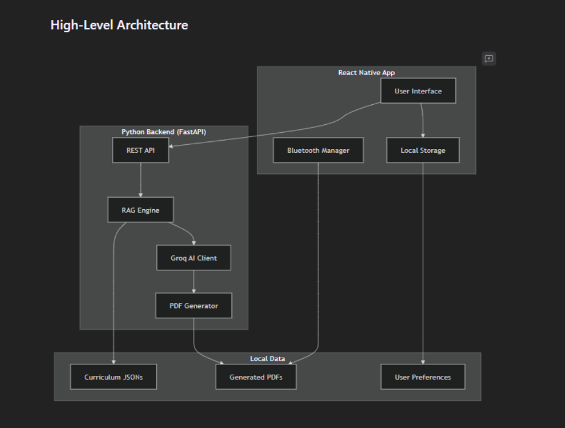
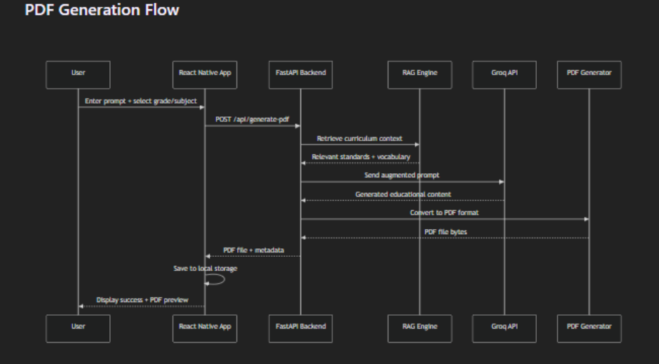

# Steel Works Hackathon 2026

An offline-first, cost-efficient learning app designed for rural area learners. Works on iOS, Android, and Desktop devices. Leverages Groq’s large language models for fast PDF generation and offline sharing.

---

## Table of Contents
- [How to Run](#how-to-run)
- [Key Features](#key-features)
- [Key Technical Features](#key-technical-features)
- [Helpful Information](#helpful-information)
- [Screenshot / Image](#screenshot--image)

---

## How to Run

### 1. Clone the Repository

```
git clone https://github.com/saharshambati1/Steel_works_hackathon_2026.git
cd Steel_works_hackathon_2026
npm install
```
### 2. Set up Groq API Key
1. Go to [Groq](https://groq.com) and create an account.  
2. Generate an API key.  
3. Copy your API key.  
4. Navigate to the `backend` folder.  
5. Create a `.env` file and add:  
```env
GROQ_API_KEY=<Paste your API Key here>
```

### 3. Set Your IPV4 Address
Open terminal and type:

```
ipconfig
```
Find your IPv4 address.

Open services/api.ts and set your API_BASE_URL to the IPv4 address.
```
const API_BASE_URL = 'http://<Paste your IP4 Address here>:8000';
```
### 4. Run the Backend
```
cd backend
pip install requirements.txt
python -m uvicorn main:app --host 0.0.0.0 --port 8000
```

### 5. Run the Expo App
Install Expo Go on your mobile device.

Run:
```
npx expo start
```
If it doesn’t work, try:
```
npx expo start --tunnel
```
Switch to Expo GO mode (type S) if necessary.

Scan the QR code shown in the terminal.

## Key Features
- Cost-efficient learning solution for rural areas

- Minimal internet required for a single session

- Allows offline local learning

- Works across iOS, Android, and Desktop devices

## Key Technical Features
- Offline file sharing via AirDrop and Quick Share (Nearby Share)

- Retrieval-Augmented Generation (RAG) with Groq’s LLMs

- Lightweight files (3-7 KB)

- Fast PDF generation (~1.7 seconds / 1753ms)

- Supports PDF generation in 2 languages

- Smooth, seamless animations

- Python backend & React Native frontend

## Helpful Information
- [Expo Docs](https://docs.expo.dev/)

- [Groq Docs](https://console.groq.com/docs/overview)

- [GitHub Docs](https://docs.github.com/en)

## Architecture Images



